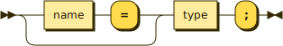
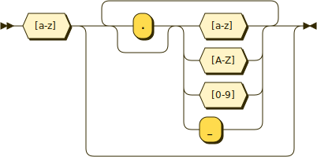
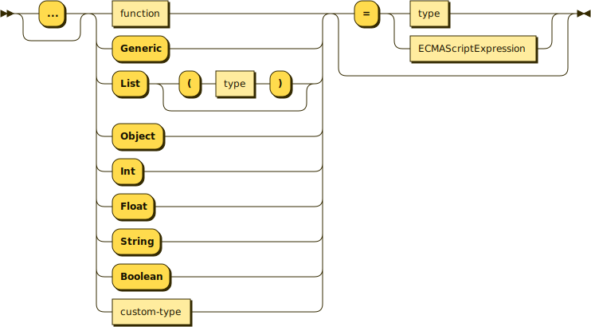

## Function Signatures

### Function Signatures follow these [``EBNF``](https://en.wikipedia.org/wiki/Extended_Backus%E2%80%93Naur_Form)s;

#### ``signature``

```ebnf
signature ::= (name '=')? type ';'
```
#### ``name``

```ebnf
name ::= [a-z] (('.')? [a-zA-Z0-9_])*
```
#### ``type``

```ebnf
type ::= (
    'Fn' ('(' (name ':')? type (',' (name ':')? type)* (',')? ')')? ('->' type)? ('=' (type | ECMAScriptExpression))?
    | 'Generic'
    | 'List' ('(' type ')')?
    | 'Object'
    | 'Int'
    | 'Float'
    | 'String'
    | [A-Z] [A-Za-z0-9]*
)
```

