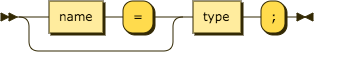
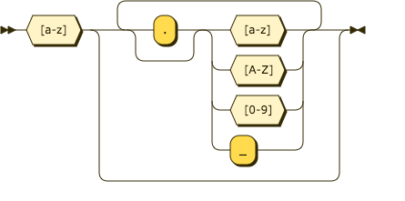
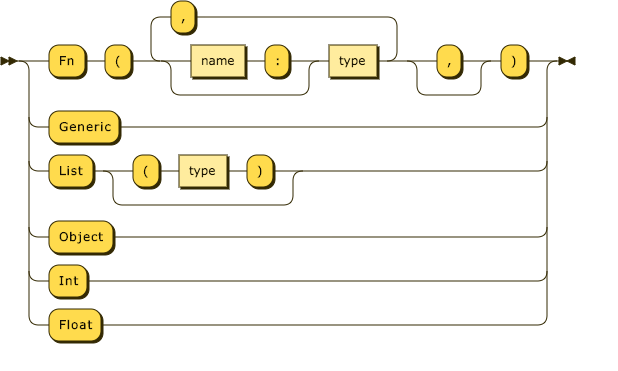

## Function Signatures

### Function Signatures follow the following format ([``EBNF``](https://en.wikipedia.org/wiki/Extended_Backus%E2%80%93Naur_Form));

#### ``signature``

```ebnf
signature ::= (name '=')? type ';'
```
#### ``name``

```ebnf
name ::= [a-z] (('.')? [a-zA-Z0-9_])*
```
#### ``type``

```ebnf
type ::= (
    ('Fn' '(' (name ':')? type (',' (name ':')? type)* (',')? ')')
    | 'Generic'
    | 'List' ('(' type ')')?
    | 'Object'
    | 'Int'
    | 'Float'
)
```

